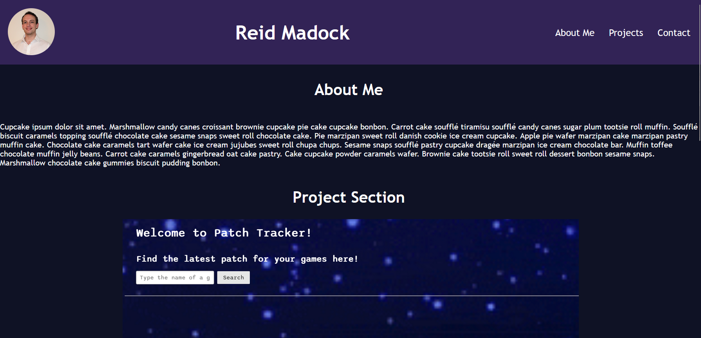

# Advanced CSS: Portfolio

## Intro
Portfolio displaying programming related projects. The project still needs a better repo name, real projects, real About Me, and contact info. The skeleton is here to make iterative styling improvements. At the moment the website isn't using any JavaScript so it is completely CSS based.

## Link
The project can be found here [on my github.io](https://reidmadock.github.io/02-homework/)

## Screenshots
This is what the earliest functional version looks like.
